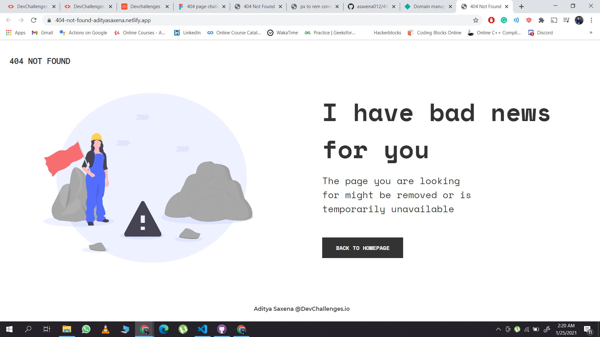

<!-- Please update value in the {}  -->

<h1 align="center">404-not-found Page</h1>

   Solution for a challenge from  <a href="http://devchallenges.io" target="_blank">Devchallenges.io</a>.

  <h3>
    <a href="https://404-not-found-adityasaxena.netlify.app/">
      Demo
    </a>
     | 
    <a href="https://devchallenges.io/challenges/wBunSb7FPrIepJZAg0sY">
      Challenge
    </a>
  </h3>

<!-- TABLE OF CONTENTS -->

## Table of Contents

- [Overview](#overview)
- [Features](#features)
- [Contact](#contact)
- [Acknowledgements](#acknowledgements)

<!-- OVERVIEW -->

## Overview

Came across this challenge from twitter, decided to solve it as a basics practice task.

- Where can I see your demo?
    &nbsp; &nbsp; &nbsp; You can click [here](https://404-not-found-adityasaxena.netlify.app/) to check out live demo.
- What have you learned/improved?
    &nbsp; &nbsp; &nbsp; Used a combination of flexbox, absolute positioning and media queries to make it repsonsive.

## Features

<!-- List the features of your application or follow the template. Don't share the figma file here :) -->

This application/site was created as a submission to a [DevChallenges](https://devchallenges.io/challenges) challenge. The [challenge](https://devchallenges.io/challenges/wBunSb7FPrIepJZAg0sY) was to build an application to complete the given user stories.

## Acknowledgements

<!-- This section should list any articles or add-ons/plugins that helps you to complete the project. This is optional but it will help you in the future. For exmpale -->

- [Steps to replicate a design with only HTML and CSS](https://devchallenges-blogs.web.app/how-to-replicate-design/)
- [Flexbox in CSS](https://developer.mozilla.org/en-US/docs/Learn/CSS/CSS_layout/Flexbox)
- [Positioning in CSS](https://developer.mozilla.org/en-US/docs/Learn/CSS/CSS_layout/Positioning)

## Contact

- Website [aditya-saxena.netlify.app](https://aditya-saxena.netlify.app)
- GitHub [@asaxena012](https://github.com/asaxena012)
- Twitter [@keenAadi](https://twitter.com/keenAadi)
